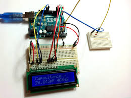

# LC Meter with Arduino Leonardo

Developed an LC Meter with Arduino Leonardo to measure inductance and capacitance values, displaying results on an LCD I2C module. Utilized components like breadboards, capacitors, resistors, LEDs, and inductors. Coded in C using Atmel Studio and Putty, this project showcases embedded systems in practical electronics measurement.

